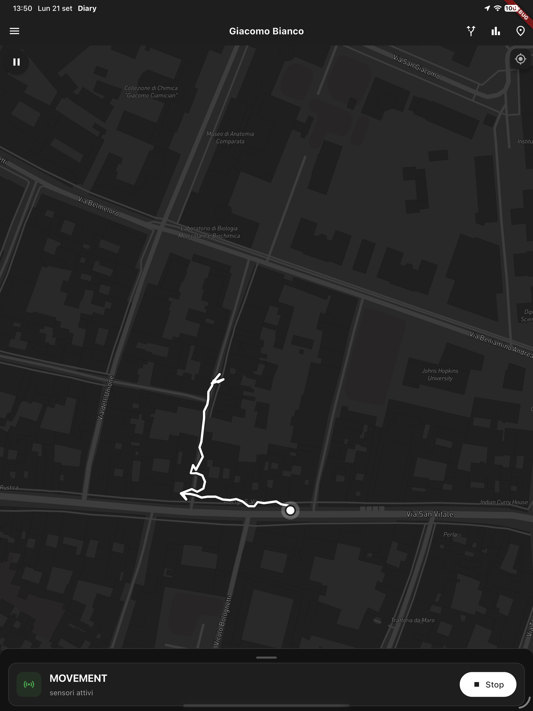
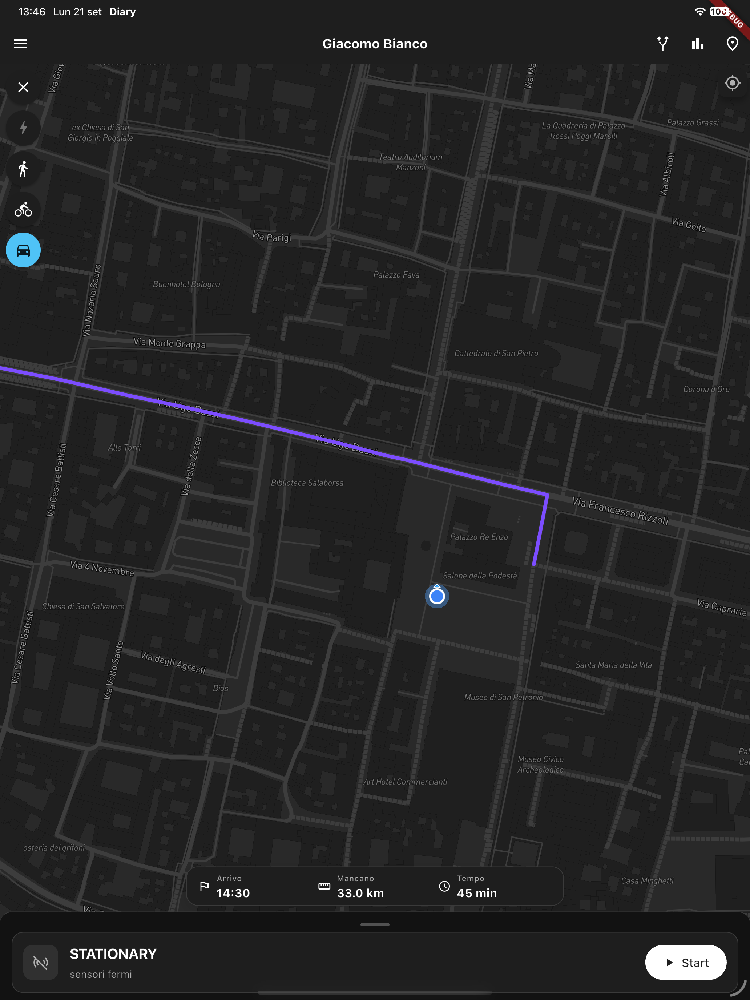
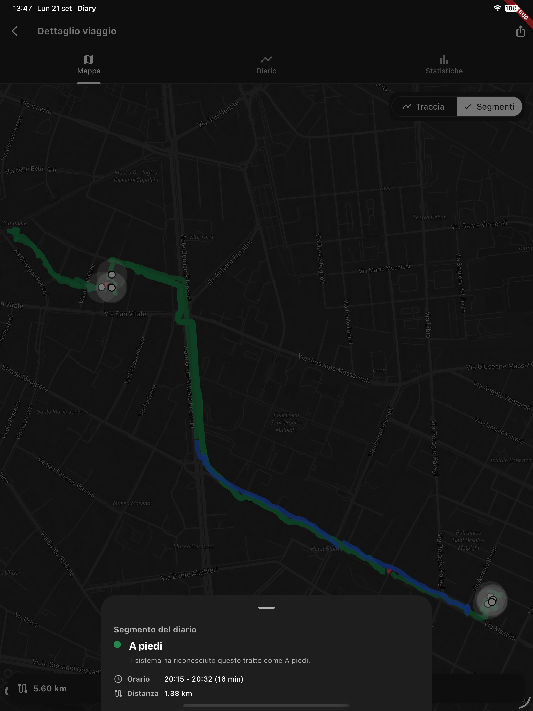
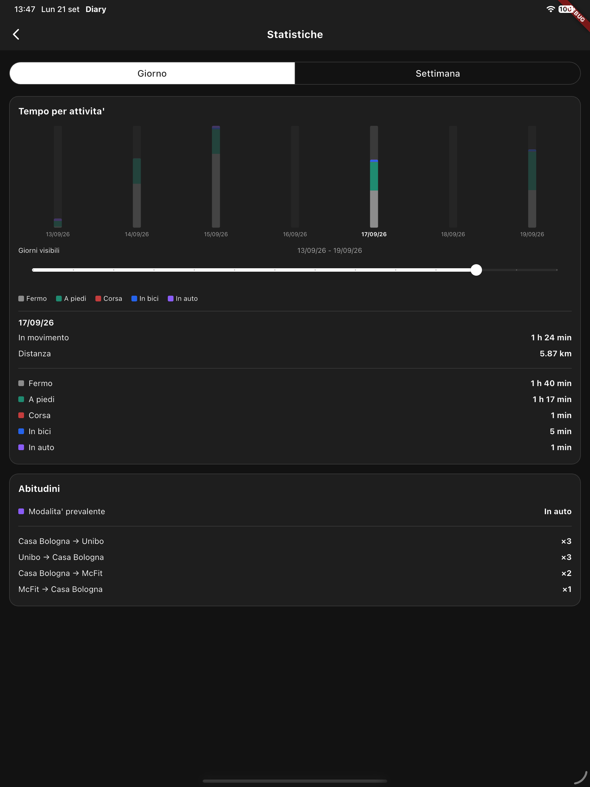

# Mobility Diary

Mobility Diary implements project track 2, *Privacy-Aware Mobility Diary with
HAR*, for the Context-Aware Systems course. The repository contains:

- `mobile/diary`: Flutter application for GPS and inertial-sensor acquisition,
  diary visualization, privacy settings, personal analytics and route assistant;
- `back-end/ninja`: Django Ninja API, Celery processing pipeline and HAR model;
- `web`: Vue staff dashboard for tracks, diary segments and privacy comparison;
- `back-end/infra`: Docker Compose stack with Nginx, Vue, Django, Celery,
  PostgreSQL/PostGIS, Redis and MinIO;
- `HAR-training-material`: training and evaluation scripts for the HAR model;
- `relazione_finale`: IEEE technical report and experimental results.

## Screenshots

<p float="left">
  
  
  
  
</p>

## Requirements

- Docker Engine with Docker Compose v2;
- Flutter and an iOS/Android device for the mobile application;
- a Mapbox account and public access token (free tier is enough), see
  [Run the mobile application](#run-the-mobile-application).

The complete server and Web dashboard run through Docker. A local Python,
PostgreSQL, Node.js or Redis installation is not required.

## Start the complete Web stack

Create the local environment file and replace the placeholder secrets:

```bash
cp back-end/infra/.env.example back-end/infra/.env
docker compose -f back-end/infra/docker-compose.yml up --build -d
```

This is also the complete first-start procedure: Compose waits for PostgreSQL
and MinIO initialization, applies all database migrations, creates the demo
accounts, imports the demo trip and then starts the application services. On a
fresh installation—especially when x86 images are emulated on an ARM host—the
initialization can take a few minutes. Its progress can be checked with the
command below; no second `docker compose up` invocation should be necessary.

Before the Web service starts, the local Compose stack automatically creates
two demo accounts.

Dashboard administrator:

- email: `admin@mobility.local`
- password: `MobilityAdmin123!`

Mobile application user:

- email: `user@mobility.local`
- password: `MobilityUser123!`

The administrator can sign in to the Vue dashboard. The normal user can sign
in to the Flutter application and is available for selection in the dashboard.
The initialization is idempotent: it does not duplicate accounts or reset a
password changed after the first startup.

The stack also imports a bundled real trip for the normal user. It includes the
processed diary, 179 GPS points, two mobility segments and 92 raw sensor
windows stored in MinIO, together with its movement-state transition. The local
trip has a new identity, has no relationship with a production trip and is
immediately available as a reloadable source.
Re-running Compose restores the raw object if needed without duplicating the
database trip.

To create an additional staff account manually, the standard Django command
remains available:

```bash
docker compose -f back-end/infra/docker-compose.yml exec web \
  python manage.py createsuperuser
```

The services are then available at:

- Web dashboard: <http://localhost:8080>
- API documentation: <http://localhost:8080/api/docs>
- Django administration: <http://localhost:8080/admin/>
- MinIO console: <http://localhost:9001> (username `minioadmin`, password
  `MobilityMinio123!`, from `S3_ACCESS_KEY_ID`/`S3_SECRET_ACCESS_KEY` in
  `back-end/infra/.env.example`)

Check the containers with:

```bash
docker compose -f back-end/infra/docker-compose.yml ps
```

The public entry point is the `gateway` container. It sends `/api/*`,
`/admin/*` and `/static/*` to Django, `/mobility-trips/*` to MinIO, and all
other paths to the Vue single-page application.

## Run the mobile application

The mobile app requires a Mapbox public access token (used for the map style
and the route assistant). Create a free Mapbox account, generate a public
token from the [Mapbox account dashboard](https://account.mapbox.com/), then
set it locally:

```bash
cd mobile/diary
flutter pub get
cp env/dart_defines.example.json env/dart_defines.local.json
```

Replace `MAPBOX_ACCESS_TOKEN` in the newly created `env/dart_defines.local.json`
with your own token. This file is git-ignored and never committed.

By default the app talks to the production API defined in
`lib/other/constants/api_constants.dart`. To point it at the local Docker stack
started above instead (recommended to see the bundled demo trip end to end),
add `API_BASE_URL` to the run command. The correct host depends on where the
app runs relative to the machine running Docker Compose:

```bash
# iOS Simulator (shares the host network, use localhost)
flutter run --dart-define-from-file=env/dart_defines.local.json \
  --dart-define=API_BASE_URL=http://localhost:8080/api

# Android Emulator (10.0.2.2 is the emulator's alias for the host machine)
flutter run --dart-define-from-file=env/dart_defines.local.json \
  --dart-define=API_BASE_URL=http://10.0.2.2:8080/api

# Physical device on the same Wi-Fi as the Docker host (replace with that
# machine's LAN IP, e.g. from `ipconfig getifaddr en0` on macOS)
flutter run --dart-define-from-file=env/dart_defines.local.json \
  --dart-define=API_BASE_URL=http://<host-lan-ip>:8080/api
```

`back-end/infra/.env.example` already allows `10.0.2.2` (Android emulator) in
`DJANGO_ALLOWED_HOSTS`; add a physical device's LAN IP to that variable in your
own `.env` only if you use the third option.

## Route assistant on a simulator/emulator

The route assistant asks Mapbox for a walking/cycling/driving route between the
current position and the searched destination. Mapbox cannot compute such a
route across an ocean, so it replies with an HTTP 422 error if the two points
are not on the same connected road/path network.

The Android Emulator's default simulated location is Google's headquarters in
Mountain View, California; the iOS Simulator's built-in presets (e.g. "Apple",
"City Run", "City Bicycle Ride") are also in the San Francisco Bay Area. If you
search for an Italian destination while the simulator/emulator is still at its
default location, the request will fail with that 422 error - this is expected,
not a bug.

To try the route assistant on a simulator/emulator, either:

- search for a destination near the Bay Area instead (e.g. "Palo Alto",
  "Mountain View", "San Francisco", "Cupertino"), or
- set a custom simulated location near Italy first:
  - Android Emulator: extended controls (`...`) → Location → set custom
    coordinates → Set Location.
  - iOS Simulator: Features → Location → Custom Location... → set custom
    coordinates.

## Verification

Web checks:

```bash
cd web
npm ci
npm test
npm run build
```

Flutter checks:

```bash
cd mobile/diary
flutter analyze
flutter test
```

## Demonstration script

The following sequence covers the core requirements and optional components.

1. Open the mobile app, sign in and select a privacy level.
2. Start a real recording, or use the bundled demo trip already available
   after login (no prior recording needed) to replay it or reload it
   directly as a new trip; show GPS and sensor acquisition and the live
   movement-state indicator.
3. Open the route assistant, choose a destination, select or detect the travel
   mode, and show that the route is recalculated when the detected mode changes.
4. Stop the trip and show progressive processing: track first, then HAR diary
   segments and significant-place enrichment.
5. Open the trip diary and distinguish stops from walking, running, cycling and
   motor-vehicle segments on the map and timeline.
6. Export the same diary using precise, approximate and aggregated privacy
   levels and compare the published coordinates and place labels.
7. Open personal analytics and show daily/weekly activity time, distance,
   prevalent mode, frequent routes and weekly place heatmaps.
8. Review a candidate habitual place and assign a category and custom name;
   reopen the diary to show the updated readable label.
9. Open the Vue dashboard as a staff user, choose the mobile user and compare
   private and privacy-aware layers, metrics, timeline and activity filters.
10. Open `/api/docs` to show the documented REST surface and conclude with the
    HAR confusion matrix and privacy/QoS experimental results from the report.

Keep at least two processed trips available before the discussion so the daily
aggregation, weekly analytics, frequent routes and place mining are visible.

## Stop and clean up

Stop the services without deleting collected data:

```bash
docker compose -f back-end/infra/docker-compose.yml down
```

To reset the demo database and object storage, remove the named volumes only
after making a backup.
